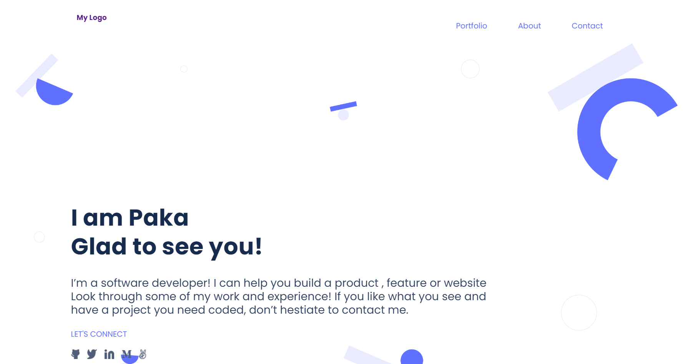

# My Portfolio

>This Website is my portfolio, basically the range of my investments through my training in Microverse. My Portfolio website is in both Mobile and Desktop versions.

This Website page contains three sections. The first section, the Header, is simply an introduction. The second section is where you find most of my achievments and completed projects. The third section is my social media and the contact form. My Portfolio has popup interactions. I used the Figma phototype to export the background and icons, logo. Also, I parsed a Figma design to create a UI. `Formspree service(https://formspree.io/html)` collects and saves the data in the Form............

## Built With

- HTML
- CSS
- Js

## Live Demo
- [Live Demo Link](https://paka-my-portfolio.netlify.app/)

## Getting Started
To get a local copy up and running follow these simple example steps.

- You can clone this repo by typing git clone `https://github.com/OLIPLICHE/My-Portfolio.git` on your terminal
- Type cd `My-Portfolio` to access the project on the terminal

### Prerequisites
- Text editor
- Git
- Html
- CSS
- Js

## Authors
👤 **Olipliche Mavoungou Paka**
- GitHub: [@githubhandle](https://github.com/OLIPLICHE)
- LinkedIn: [LinkedIn](https://www.linkedin.com/in/olipliche-paka-mavoungou/)

## Contributors
👤 **Yannick-Noel AKA**
- GitHub: [@githubhandle](https://github.com/codecaiine)

👤 **Ellis Ng'ona**
- GitHub: [@githubhandle](https://github.com/mwanawabangona)

## 🤝⭐️ Contributing

Contributions, issues, and feature requests are welcome!

Feel free to check the [issues page](https://github.com/OLIPLICHE/My-Portfolio/issues).

## Show your support

Give a ⭐️ if you like this project!

## 📝 License

This project is [MIT](./MIT.md) licensed.
